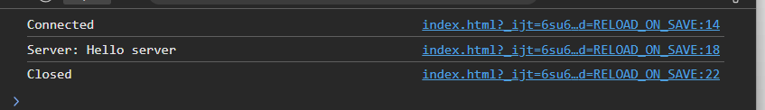

# WebSocket Chat Server

[]

## Overview 
This is basically a fully functional WebSocket Server , Completely Capable
of Communicating with a browser (Tested on MS Edge) So a Proper 
RFC 6455 Handshake Protocol is Present 


## Theory 
 
A Client First uses an Http Request to check whether server is
capable of Websocket connection and if Yes then Request Upgrade

This is how client Request Upgrade in My app (Request From Edge for example)

```
GET ws://localhost:9090/chat HTTP/1.1
Host: localhost:9090
Connection: Upgrade
Pragma: no-cache
Cache-Control: no-cache
User-Agent: Mozilla/5.0 (Windows NT 10.0; Win64; x64) AppleWebKit/537.36 (KHTML, like Gecko) Chrome/148.0.0.0 Safari/537.36 Edg/148.0.0.0
Upgrade: websocket
Origin: http://localhost:63342
Sec-WebSocket-Version: 13
Accept-Encoding: gzip, deflate, br, zstd
Accept-Language: en-US,en;q=0.9,hi;q=0.8
Sec-WebSocket-Key: vo54yDXdZ9jeqm0DYJXDbQ==
Sec-WebSocket-Extensions: permessage-deflate; client_max_window_bits
```
and this is how server acknowledge the req and upgrade
connection

```http request
HTTP/1.1 101 Switching Protocols
Upgrade: websocket
Connection: Upgrade
Sec-WebSocket-Accept: EDMqUVgl7Y79Jn8Vo0XR9L+dwPc=
```

Now After Upgrade we Follow RFC 6455 Handshake Protocol 
To send and Recieve data ,See this Diagram for
Better Understanding 

```
0                   1                   2                   3
0 1 2 3 4 5 6 7 8 9 0 1 2 3 4 5 6 7 8 9 0 1 2 3 4 5 6 7 8 9 0 1
+-+-+-+-+-------+-+-------------+-------------------------------+
|F|R|R|R| opcode|M| Payload len |    Extended payload length    |
|I|S|S|S|  (4)  |A|     (7)     |             (16/64)           |
|N|V|V|V|       |S|             |   (if payload len==126/127)   |
| |1|2|3|       |K|             |                               |
+-+-+-+-+-------+-+-------------+ - - - - - - - - - - - - - - - +
|     Extended payload length continued, if payload len == 127  |
+ - - - - - - - - - - - - - - - +-------------------------------+
                                |                               |Masking-key, if MASK set to 1  |
                                +-------------------------------+-------------------------------+
                                | Masking-key (continued)       |          Payload Data         |
                                +-------------------------------- - - - - - - - - - - - - - - - +
                                :                     Payload Data continued ...                :
+ - - - - - - - - - - - - - - - - - - - - - - - - - - - - - - - +
|                     Payload Data continued ...                |
+---------------------------------------------------------------+
```
___
### Basic Explanation of Diagram 


### First Byte

A Byte consist of  8 bits  (Binary) the first Bit represent
whether the Frame is final Frame (Fragmentation)
and the last 4 bit is about opcode which is hard coded
0001 in my code (0000 for rest of frame as only first frame contains opcode in fragmentation)

0001 means text in RFC- 6455 Protocol which is enough for our
text only chat server

___

### Second Byte

The first bit here represent the mask presence (it's a random generated 4 numbers (0 - 255 range) I explain functioning later)
#### Note :- Server sends unmasked frames as required by RFC 6455
and rest 7 bits represent payload length
there are few cases around this payload length
##### Case-1 (length <= 125) 
this is the real payload length

#### Case-2 (length == 126)
Read Next two Bytes to get true length because length
of payload can not be represented  in 7 bits alone
means 126 <= length <= 65,535

### Case-3 (length == 127)

Read Next 8 Bytes to get true length as range of length is
127 <= (2^64) -1 

After this you read  4-byte masking key if mask bit is set 
and then read your payload info from length 
___

### Masking Algorithm :-

```
function mask(payload, maskKey[4]):
    masked = new byte[payload.length]

    for i from 0 to payload.length - 1:
        masked[i] = payload[i] XOR maskKey[i mod 4]

    return masked
```


## Features 

1. Proper RFC 6455  protocol
2. Using HTML + Browser as Client for Easier debugging
3. Fragmentation Support in both reading and writing (2048 Byte max per frame)

## Prerequisites 

1. Browser
2. Java 17

## Setup

```shell
// For windows ( i already configured plugin to use run)
./gradlew build
./gradlew run 
```
## Testing 
Console will Echo the message coming from browser using index.html
i provided in test-client format you can close socket 
or send message using buttons provided



## Future Features 
Adding multiple clients for a single Server
